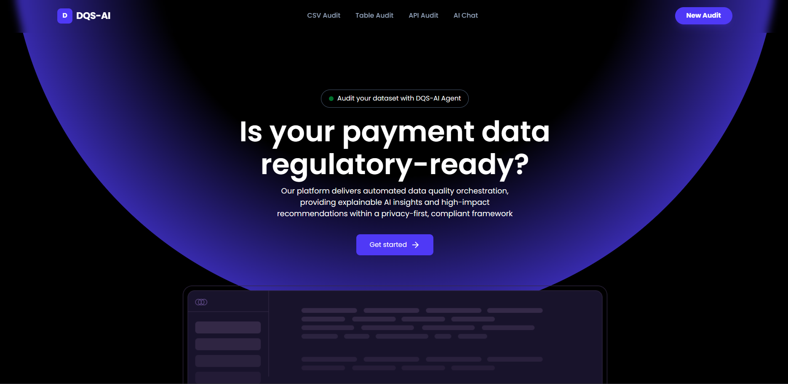
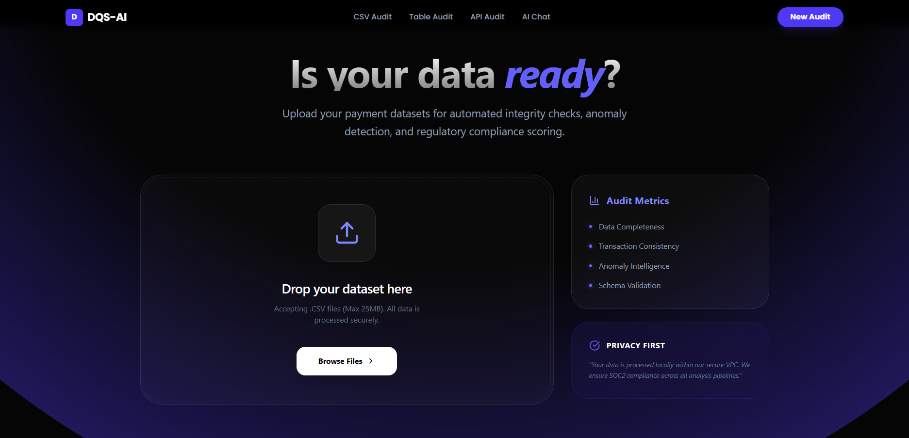
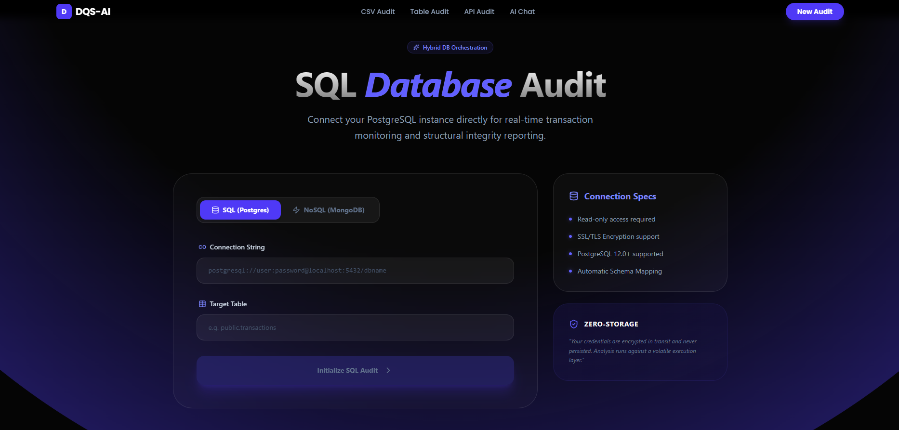
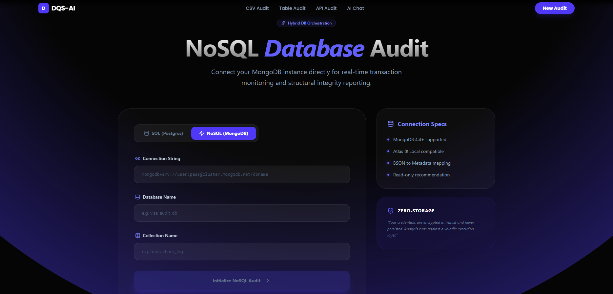
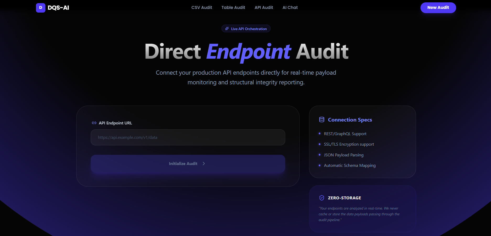
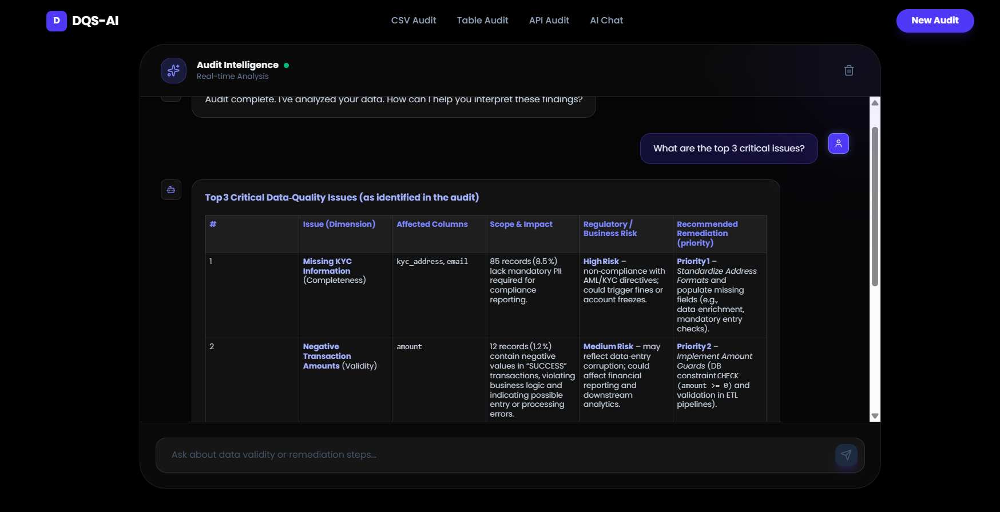

# DQS-AI: Agentic Data Quality Scoring Framework

DQS-AI is a next-generation automated data quality auditing system that combines deterministic rule-based scoring with Large Language Model (LLM) reasoning to provide 360-degree visibility into dataset integrity.

Developed for academic research and mini-project submission, it demonstrates the power of **Agentic AI** in the domain of Data Engineering and Governance.

---

## 📸 Visual Walkthrough

| **Dashboard Home** | **CSV Audit Interface** |
|:---:|:---:|
|  |  |

| **SQL Database Connection** | **NoSQL Database Analysis** |
|:---:|:---:|
|  |  |

| **API Endpoint Audit** | **AI Chatbot Reasoning** |
|:---:|:---:|
|  |  |

---

## 🚀 Key Features

- **Multi-Source Auditing**: Support for CSV uploads, PostgreSQL, and MongoDB connections.  
- **Hybrid Scoring Engine**: Combines high-speed rule-based checks (PII detection, nullity, type-matching) with LLM-powered deep analysis.
- **Agentic Insights**: A streaming AI Chatbot that understands your audit context and provides remediation roadmaps.  
- **Regulatory Compliance**: Mapping of data anomalies to GDPR, CCPA, and AML risk factors.
- **Professional Reporting**: One-click generation of printable PDF/Markdown audit reports.
- **Interactive Evaluation**: Built-in benchmarking suite to measure AI precision, recall, and F1 scores.

## 🏗️ Architecture

- **Frontend**: React (Vite) + Tailwind CSS + Framer Motion (for premium UI/UX).
- **Backend (Orchestrator)**: Express.js (Node.js) handling database connectors and metadata extraction.
- **AI Service**: FastAPI (Python) + LangChain + Groq (LLM Inference) for rapid GenAI reasoning.
- **Database Support**: MongoDB and PostgreSQL.

## 🛠️ Quick Start

### 1. Prerequisites
- Node.js (v18+)
- Python (3.10+)
- Groq API Key (gsk_...)

### 2. Installation & Setup

#### AI Service
```bash
cd ai-services
pip install -r requirements.txt
# Add GROQ_API_KEY to .env
python main.py
```

#### Backend Server
```bash
cd server
npm install
node index.js
```

#### Client
```bash
cd client
npm install
npm run dev
```

### 3. Usage
1. Open `http://localhost:3000`.
2. Navigate to **CSV Audit** and click **"Try with sample dataset"**.
3. View the **Composite Quality Score** and anomalies.
4. Click **"Chat with AI"** to ask specific questions about your data issues.

## 🔬 Evaluation & Research
The system includes a dedicated evaluation framework in the `/evaluation` directory.
Run the benchmarks to see real-world performance metrics:
```bash
cd evaluation
python run_evaluation.py
```

## 📜 Academic Context
This project was built to explore the intersection of **Generative AI** and **Data Quality Management**. By offloading the "reasoning" of why a column is defective to an LLM, we reduce the manual burden on Data Stewards and accelerate the remediation lifecycle.